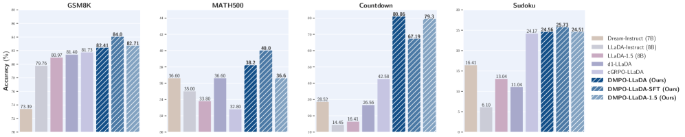

# Enhancing Reasoning For Diffusion LLMs via Distribution Matching Policy Optimization (DMPO)
[](https://arxiv.org/pdf/2510.08233)
[](LICENSE)
[](https://x.com/YuchenZhu_ZYC/status/2035061894890033156)


This is the official implementation of DMPO.




## Update
[Mar 25, 2026] Major code update: added fast KV-cache samplers (Fast-dLLM, WINO), ELBO-based reference log-probability estimation, and improved evaluation pipeline.

[Oct 9, 2025] We have open sourced the code of DMPO for dLLM training.


## Environment Installation

**Option 1: conda**
```
conda env create -f env.yml
conda activate dmpo
```

**Option 2: uv (recommended)**
```bash
bash setup_env.sh
source .venv/bin/activate
```


## Project Structure
```
DMPO/
├── DMPO/                    # Training code
│   ├── dmpo_train.py        # Training entry point
│   ├── dmpo_trainer.py      # DMPOTrainer (extends TRL's GRPOTrainer)
│   ├── DMPO_config.py       # Training configuration dataclass
│   ├── dmpo_train_config.yaml  # Default hyperparameters
│   ├── accelerate.yaml      # DeepSpeed ZeRO-2 config
│   ├── data_utils.py        # Dataset loading utilities
│   ├── reward_func.py       # Reward functions per task
│   ├── math500_utils.py     # Math answer parsing helpers
│   └── utils.py             # Logging utilities
├── eval/                    # Evaluation code
│   ├── eval.py              # Distributed evaluation script
│   ├── generate.py          # Diffusion decoding (LLaDA, WINO)
│   ├── gsm8k.py             # GSM8K dataset & prompts
│   ├── math500.py           # MATH-500 dataset & prompts
│   ├── countdown.py         # Countdown dataset & prompts
│   ├── sudoku.py            # 4x4 Sudoku dataset & prompts
│   ├── parsers.py           # Answer extraction & equivalence
│   ├── parse_and_get_acc.py # Accuracy aggregation
│   └── parser_helper.py     # Math string normalization
├── fast_samplers/           # Fast KV-cache sampler implementations
│   ├── fast_dllm/           # Fast-dLLM (confidence-aware parallel decoding)
│   ├── wino/                # WINO (Wide-In, Narrow-Out)
│   ├── llada/               # LLaDA reference implementation
│   └── freedave/            # FreeDave reference implementation
├── dataset/                 # Evaluation datasets
│   ├── 4x4_sudoku_unique_puzzles.csv
│   ├── 4x4_test_sudoku.csv
│   └── countdown_cd3_test.jsonl
├── setup_env.sh             # uv-based environment installer
└── env.yml                  # conda environment spec
```


## Supported Tasks

| Task | Train Source | Eval Source | Reward |
|------|-------------|-------------|--------|
| **GSM8K** | [openai/gsm8k](https://huggingface.co/datasets/openai/gsm8k) | Same (test split) | Format + exact match |
| **MATH-500** | [ankner/math-500](https://huggingface.co/datasets/ankner/math-500) | [HuggingFaceH4/MATH-500](https://huggingface.co/datasets/HuggingFaceH4/MATH-500) | Boxed answer equivalence |
| **Countdown** | [Jiayi-Pan/Countdown-Tasks-3to4](https://huggingface.co/datasets/Jiayi-Pan/Countdown-Tasks-3to4) | `dataset/countdown_cd3_test.jsonl` | Equation correctness |
| **Sudoku (4x4)** | `dataset/4x4_sudoku_unique_puzzles.csv` | `dataset/4x4_test_sudoku.csv` | Cell-level accuracy |


## Training

Launch training with `accelerate` (8 GPUs, DeepSpeed ZeRO-2):

```bash
cd DMPO

accelerate launch \
    --config_file accelerate.yaml \
    --num_processes 8 \
    dmpo_train.py \
    --config dmpo_train_config.yaml \
    --dataset gsm8k
```

Key arguments (override defaults in `dmpo_train_config.yaml` via CLI):

| Argument | Default | Description |
|----------|---------|-------------|
| `--dataset` | `gsm8k` | Task: `gsm8k`, `math`, `countdown`, `sudoku` |
| `--use_fast_sampler` | `fast_dllm` | Fast sampler: `fast_dllm`, `wino`, `no` |
| `--sampler` | `pd_cache_prefix` | Decoding strategy: `roar`, `llada`, `pd`, `pd_cache_prefix`, `pd_cache_dual`, `wino` |
| `--alpha` | `0.04` | Temperature for CE loss |
| `--temperature` | `0.2` | Sampling temperature |
| `--num_iterations` | `8` | Buffer refresh interval (gradient steps) |
| `--num_generations` | `16` | Roll-outs per prompt |
| `--pretrained_model_path` | `GSAI-ML/LLaDA-8B-Instruct` | Base model |

See `DMPO/dmpo_train_config.yaml` for the full list of hyperparameters.


## Evaluation

Run distributed evaluation with `torchrun`:

```bash
cd eval

torchrun --nproc_per_node 8 eval.py \
    --dataset gsm8k \
    --batch_size 8 \
    --gen_length 256 \
    --model_path GSAI-ML/LLaDA-8B-Instruct \
    --checkpoint_path <path_to_checkpoint>
```

To evaluate all tasks at multiple generation lengths, use `run_eval.sh`:
```bash
cd eval
bash run_eval.sh
```

Parse results:
```bash
python parse_and_get_acc.py --dir <output_dir>
```


## Acknowledgement
This code base is built upon [d1](https://github.com/dllm-reasoning/d1). We thank the authors for providing a clean and reproducible repo. The fast sampler implementations are adapted from [Fast-dLLM](https://github.com/NVlabs/Fast-dLLM), [WINO-dLLM](https://github.com/Feng-Hong/WINO-DLLM), and [FreeDave](https://github.com/cychomatica/FreeDave).
